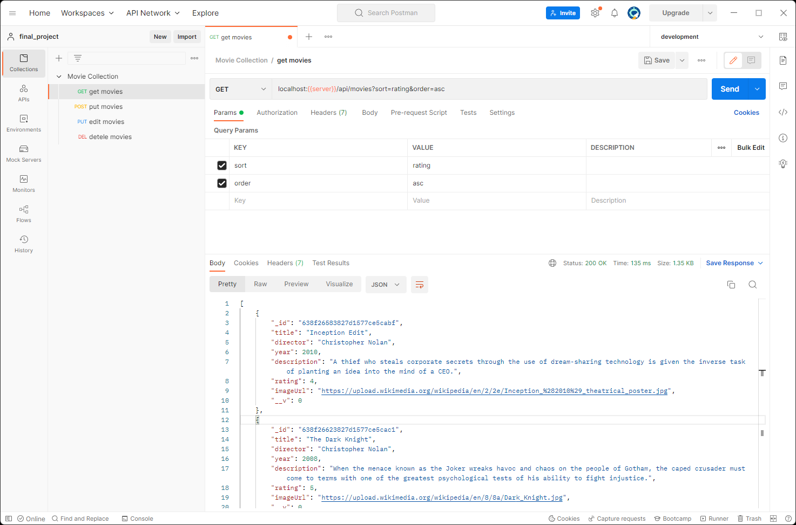

## 🔥TBD Final Project

<br>



<br>

This project is an example of a RESTful API that allows users to manage a collection of movies. It includes the following features:

-   `GET /movies`: Retrieves a list of movies in the collection, with optional parameters `limit`, `sort`, and `order`
-   `GET /movies/:id`: Retrieves a movie with the specified `id`
-   `POST /movies`: Creates a new movie in the collection
-   `PUT /movies/:id`: Updates a movie with the specified `id`
-   `DELETE /movies/:id`: Deletes a movie with the specified `id`
-   `GET /movies/search/:keyword`: Searches for movies by keyword

## Prerequisites

-   [Node.js](https://nodejs.org/en/)

## Installation

1. Clone this repository

    git clone `https://github.com/hdytrfli/TBDFinalProject`

2. Install the dependencies

    `cd repo`
    `npm install`

3. Setup the environment variables

    `cp .env.example .env`

    Edit the `.env` file to set the ` PORT``,  `MONGODB_URI`, etc.

4. Start the development server

    `npm start:server`

## Usage

-   get /movies

    -   `limit`: The number of movies to return (default: 10)
    -   `sort`: The field to sort by (default: `title`)
    -   `order`: The order to sort by (default: `asc`)

    ```javascript
    fetch('/movies?limit=5&sort=year&order=desc')
    	.then((response) => response.json())
    	.then((movies) => console.log(movies));
    ```

-   get /movies/:id

    ```javascript
    fetch('/movies/5c9d4d9e0f1cfc0017b660e6')
    	.then((response) => response.json())
    	.then((movie) => console.log(movie));
    ```

-   post /movies

    ```javascript
    fetch('/movies', {
    	method: 'POST',
    	headers: {
    		'Content-Type': 'application/json',
    	},
    	body: JSON.stringify({
    		title: 'The Matrix',
    		year: 1999,
    		director: 'The Wachowskis',
    		actors: ['Keanu Reeves', 'Laurence Fishburne', 'Carrie-Anne Moss'],
    	}),
    })
    	.then((response) => response.json())
    	.then((movie) => console.log(movie));
    ```

-   put /movies/:id

    ```javascript
    fetch('/movies/5c9d4d9e0f1cfc0017b660e6', {
    	method: 'PUT',
    	headers: {
    		'Content-Type': 'application/json',
    	},
    	body: JSON.stringify({
    		title: 'The Matrix Reloaded',
    	}),
    })
    	.then((response) => response.json())
    	.then((movie) => console.log(movie));
    ```

-   delete /movies/:id

    ```javascript
    fetch('/movies/5c9d4d9e0f1cfc0017b660e6', {
    	method: 'DELETE',
    })
    	.then((response) => response.json())
    	.then((movie) => console.log(movie));
    ```

-   get /movies/search/:keyword

    ```javascript
    fetch('/movies/search/matrix')
    	.then((response) => response.json())
    	.then((movies) => console.log(movies));
    ```

## License

This project is licensed under the MIT License - see the [LICENSE](LICENSE) file for details.
